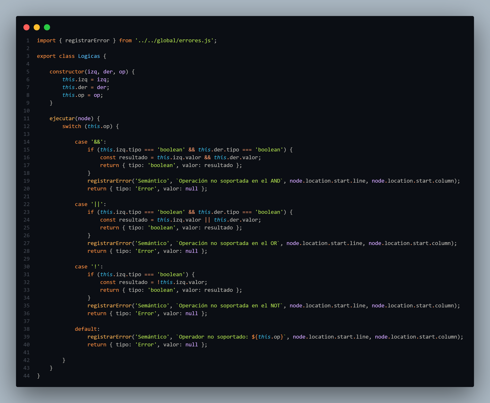
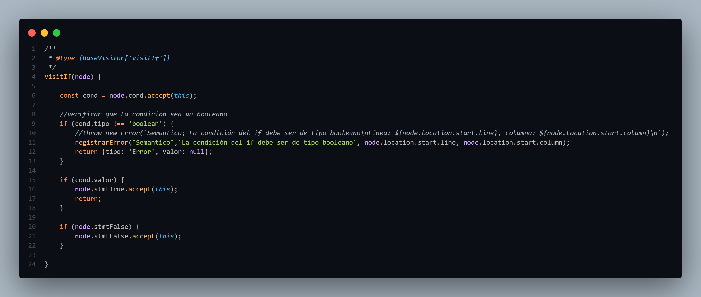
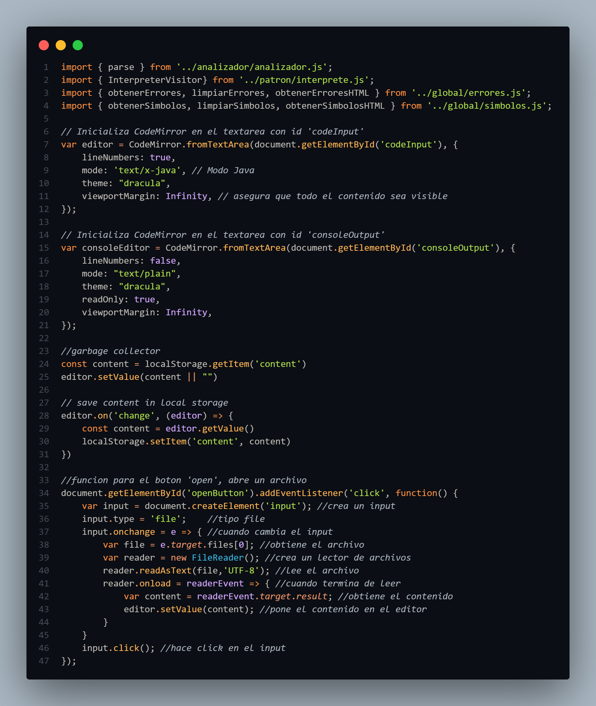
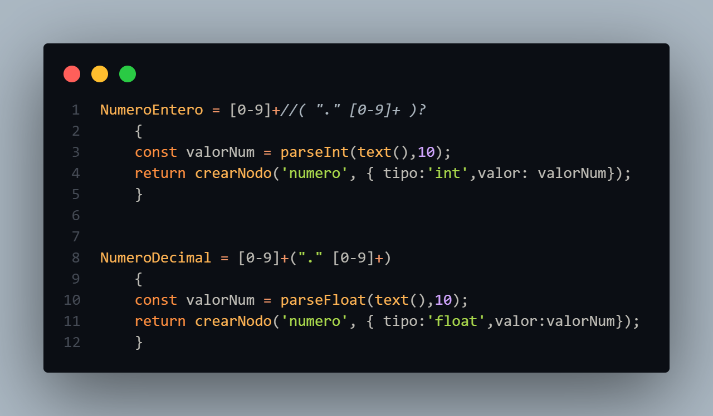
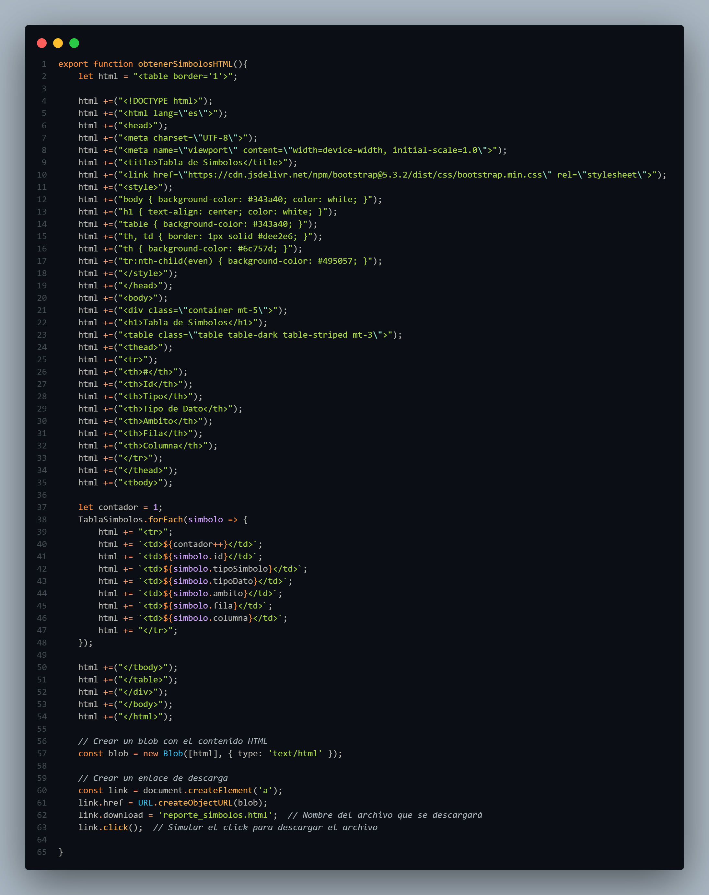
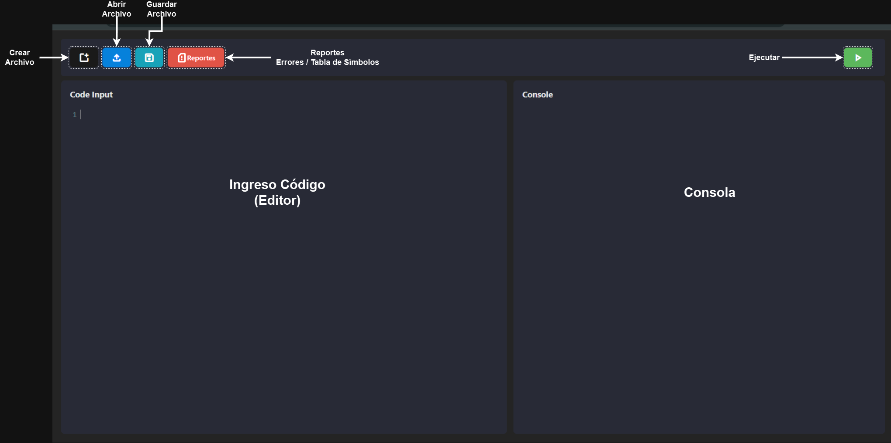

# 
 🏆 **JavaGlimpse  - Manual Técnico**

## 📖 **Índice**

1. [Introducción](#🔥-introducción)
2. [Tecnologías Utilizadas](#💻-tecnologías-utilizadas)
3. [Funcionamiento](#🔩-funcionamiento)
4. [Arquitectura del Sistema](#🏗️-arquitectura-del-sistema)
5. [Flujo del Proyecto](#🔄-flujo-del-proyecto)
6. [Componentes](#🧩-componentes)
7. [Referencias](#📚-referencias)
---

## 🔥 **Introducción**

**JavaGlimpse** es una poderosa herramienta de análisis e interpretación de código inspirado en Java, diseñada para facilitar el desarrollo y la depuración de programas. Desplegado directamente en **GitHub Pages**, permite a los usuarios acceder desde cualquier navegador sin necesidad de instalación. Este intérprete, construido con **JavaScript** y **PeggyJS**, incluye una interfaz intuitiva basada en **CodeMirror**.

---

## 💻 **Tecnologías Utilizadas**

 

La aplicación se construyó utilizando una computadora con Sistema Operativo Windows 11, las tecnologías utilizadas fueron las siguientes:

- JavaScript
- CodeMirror
- Visual Studio Code
- Git
- PeggyJS

---

## 🔩 **Funcionamiento**

La aplicación se divide en dos partes principales: **frontend** y **backend**.

### **Backend**: 

El backend es el núcleo del intérprete y se encarga de realizar el análisis de la entrada utilizando el **patrón visitor**. El proceso de análisis se realiza en tres etapas:

1. **Análisis Léxico y Sintáctico**: El parser, construido con **PeggyJS**, analiza la estructura del código de acuerdo con las reglas gramaticales definidas, creando un árbol de sintaxis abstracta (AST).

2. **Análisis Semántico**: El AST generado es procesado mediante el **patrón visitor**, lo que permite interpretar las distintas expresiones, operaciones y sentencias del lenguaje. Esto incluye:

   - **Expresiones aritméticas y lógicas**: Evaluación de operaciones matemáticas (+, -, *, /, %, etc.) y comparaciones (==, !=, <, >, etc.).

    
     
    <text> Clase logica </text>

   - **Control de flujo**: Evaluación de sentencias como `if`, `while`, `for`, `switch-case`, y operadores de control (`break`, `continue`, `return`).

    
     
    <text> Visit if </text>

   - **Manejo de identificadores**: Resolución de variables, asignaciones y acceso a propiedades dentro de estructuras como `structs` o arrays multidimensionales.

    
     
    <text> VisitInstancia (instancia de struct) </text>

   - **Operaciones con tipos primitivos y compuestos**: Manipulación de enteros, cadenas, booleans, arrays, y structs.

    
     
    <text> Reconocimientos de números en la gramática </text>

3. **Generación de Reportes**: El backend también se encarga de generar reportes detallados sobre símbolos (variables y funciones declaradas) y errores de sintaxis o semántica encontrados durante la ejecución del código.

    
     
    <text> Generación de Reportes </text>

### **Frontend**: 

El frontend interactúa con el backend para mostrar los resultados del análisis en una interfaz amigable para el usuario, permitiendo escribir código en el editor, visualizar la salida en la consola y generar reportes.

    
     
    <text> Clase donde se realiza la construcción del frontend </text>

---

## 🏗️ **Arquitectura del Sistema**

La arquitectura de **OakLand** está dividida en los siguientes componentes clave:

| **Componente**       | **Descripción**                         |
|----------------------|-----------------------------------------|
| **Frontend**          | Basado en **CodeMirror** para la edición de código con resaltado de sintaxis. |
| **Parser**            | Desarrollado en **PeggyJS**, encargado de analizar la sintaxis y estructura del código ingresado. |
| **Backend**           | Implementación en **JavaScript** para gestionar la interpretación del código y la interacción con la consola. |

---

## 🔄 **Flujo del Proyecto**

1. **Inicio del Programa**:
   - El programa comienza con la carga o creación de un archivo que contiene el código fuente en **OakLand**.

2. **Cargar/Crear Archivo**:
   - El usuario tiene la opción de cargar un archivo existente o crear uno nuevo que contenga el código en **OakLand**.

3. **Interpretación del Código**:
   - Se utiliza el analizador léxico y sintáctico implementado con **PeggyJS** en **JavaScript** para interpretar el código **OakLand**.
   - Durante este proceso, se generan reportes de errores si se encuentran violaciones a la gramática del lenguaje.

4. **Generación de Tabla de Símbolos**:
   - Se construye una tabla de símbolos que contiene información sobre las variables, funciones u otros elementos definidos en el código.
   - La tabla de símbolos facilita el seguimiento y control de los elementos presentes en el código.

5. **Interpretación de Instrucciones**:
   - Se realiza la interpretación de las instrucciones del código **OakLand**.
   - Cada instrucción es procesada según las reglas y la semántica del lenguaje.

6. **Generación de Resultados**:
   - Se generan resultados y reportes que pueden incluir:
     - Información detallada sobre errores encontrados durante el análisis.
     - Contenido de la tabla de símbolos.
     - Resultados de la interpretación de las instrucciones mediante la consola.

7. **Fin del Programa**:
   - El programa finaliza, y el usuario puede revisar los resultados generados durante el proceso.

---

## 🧩 **Componentes**

### **Área de Código (Editor)**

Implementada con **CodeMirror**, esta área permite escribir, cargar y modificar código fuente con funcionalidades como resaltado de sintaxis y autocompletado.

### **Consola**

La consola muestra la salida del código ejecutado, errores y mensajes importantes del intérprete, lo que facilita la depuración y análisis del código.

### **Botones**

- **Ejecutar**: Inicia la interpretación del código ingresado en el editor.
- **Reportes**: Genera un reporte de símbolos y errores detectados durante la ejecución del código.
- **Limpiar**: Limpia el contenido del área de código y la consola.
- **Subir/Guardar Archivos**: Permite cargar o guardar el código escrito en un archivo local para su reutilización.

    
     
    <text> Interfaz de la aplicación </text>

---

## 📚 **Referencias**

- **Documentación de PeggyJS:** [Enlace a la documentación](https://peggyjs.org)
- **CodeMirror:** [Enlace a la documentación](https://codemirror.net)
