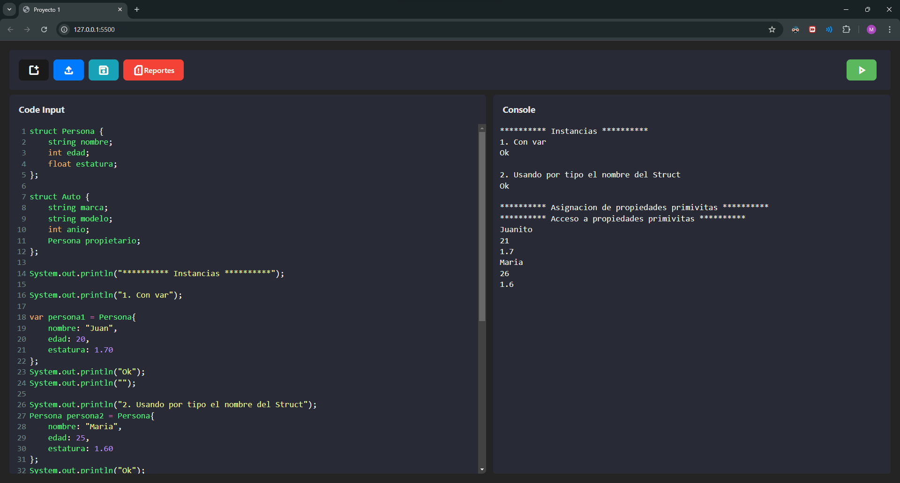
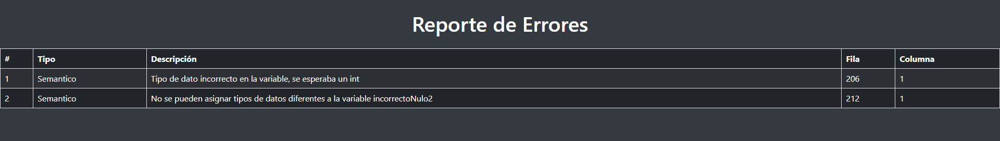
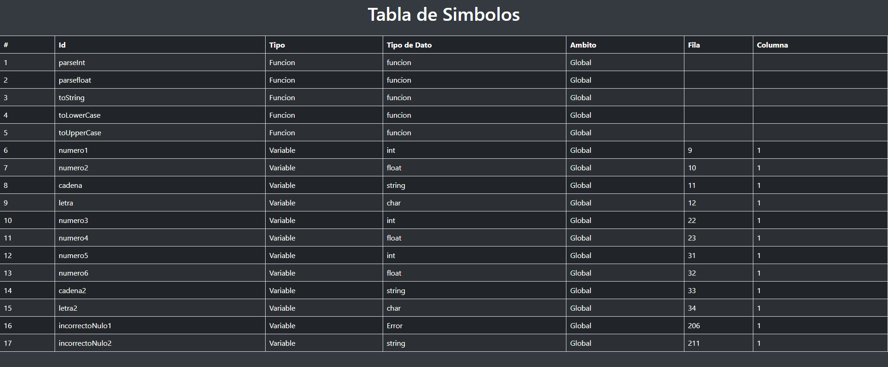
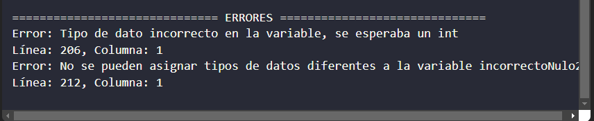

# 
🌟 **JavaGlimpse - Intérprete de Código Inspirado en Java   -Guía del Usuario-**

## 🎯 **Índice**

1. [🚀 Bienvenida](#🚀-bienvenida)
2. [💻 Primeros Pasos](#💻-primeros-pasos)
3. [🖥️ Interfaz de Usuario](#🖥️-interfaz-de-usuario)
   - [Área de Código](#área-de-código)
   - [Consola](#consola)
   - [Botones Principales](#botones-principales)
4. [⚡ Funciones Destacadas](#⚡-funciones-destacadas)
5. [🛠️ Solución de Problemas Comunes](#🛠️-solución-de-problemas-comunes)
6. [❓ FAQs](#❓-faqs)
7. [💬 Soporte y Contacto](#💬-soporte-y-contacto)
8. [🔩 Otros](#🔩-otros)

---

## 🚀 **Bienvenida**

Bienvenido a **JavaGlimpse**, tu herramienta para crear, escribir, editar y ejecutar código inspirado en Java de manera simple y eficiente. 
 
Desplegado directamente en GitHub Pages, permite a los usuarios acceder desde cualquier navegador sin necesidad de instalación.
 
OakLand destaca por su capacidad para manejar múltiples paradigmas de programación, incluyendo la orientación a objetos, programación funcional y la procedimental.

---
## 🖥️ **Interfaz de Usuario**

### Área de Código

El editor de código está basado en una interfaz simple y sencilla para el cliente, ofreciendo un entorno cómodo para escribir programas. Soporta:
- Resaltado de sintaxis.
- Carga y guardado de archivos.

### Consola

La consola muestra la salida del código que se está ejecutando, incluyendo:
- **Errores de Sintaxis**: Si algo está mal en tu código.
- **Resultados**: El output de tu programa.

### Botones Principales

- **Ejecutar**: Ejecuta el análisis de tu código.
- **Limpiar**: Borra todo el contenido de la consola y el área de código.
- **Subir/Guardar Archivo**: Permite cargar un archivo de código o guardar tu progreso.
- **Reportes**: Genera un reporte de símbolos y errores detectados.

    
     
    <text> Distibución de los botones dentro de la aplicación </text>

---

## 💻 **Primeros Pasos**

1. **Carga o Escribe tu Código**: Usa el área de código para escribir tu programa o cargar uno desde un archivo.
2. **Ejecuta el Código**: Pulsa el botón **Ejecutar** para ejecutar el análisis e interpretación.
3. **Revisa la Consola**: Los resultados aparecerán en la consola, junto con los errores o la salida generada.

    
     
    <text> Ejemplo del funcionamiento </text>

---

## ⚡ **Funciones Destacadas**

1. **Interpretación en Tiempo Real**: Escribe código y ejecútalo en tiempo real, sin necesidad de descarga alguna, presiona el siguiente enlace: 
<a href="https://mmp119.github.io/JavaGlimpse-InterpreteJAVA/">https://mmp119.github.io/JavaGlimpse-InterpreteJAVA/</a>

2. **Reportes Detallados**: Revisa los símbolos utilizados en tu código y los errores que aparezcan durante la ejecución.

    
     
    <text> Reporte de errores </text>

    
     
    <text> Reporte de tabla de símbolos </text>

3. **Resaltado de Errores**: Los errores de sintaxis aparecen directamente en el área de código, resaltando el problema.

    
     
    <text> Errores listados desde la consola </text>

---

## 🛠️ **Solución de Problemas Comunes**

| **Problema**                     | **Posible Causa**               | **Solución**                         |
|-----------------------------------|---------------------------------|--------------------------------------|
| No puedo ejecutar mi código       | Código mal escrito o incompleto | Revisa los errores destacados en el editor. |
| La consola no muestra nada        | Error en el código              | Verifica que no tengas errores de sintaxis. |
| No se generan reportes            | Archivo no válido               | Asegúrate de que el archivo cargado sea compatible. |

---

## ❓ **FAQs**

### **¿Cómo limpio el área de código y la consola?**
Pulsa el botón **Limpiar** para borrar todo el contenido.

### **¿Cómo guardo mi código?**
Haz clic en el botón **Guardar Archivo** para descargar tu código como un archivo de texto.

---

## 💬 **Soporte y Contacto**

¿Tienes alguna duda? Contáctanos a:

- **Correo electrónico:** mariomarroquin1905@gmail.com

## 🔩 **Otros**
- [Manual Técnico](./Manuales/Técnico.md)
